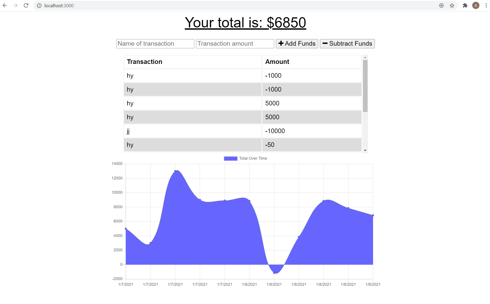

# PWA-Online-Offline-Budget-Trackers

## Description

This is a Budget Tracker application that allows users to add expenses and deposits to their budget with or without a connection. When users enter transactions offline, it will be shown on the page and added to their transaction history when their connection is back online. 

## Table of Contents

* [Built With](#builtWith)
* [Usage](#usage)
* [contributing](#credits)
* [Issues](#issues)
* [Questions](#questions)

## Built With
The program uses HTML, CSS, Bootstrap, JavaScript, MongoDB, Mongoose schema, NodeJS and Express.

## Usage
To run this application locally, install the dependencies by running `npm install` in your terminal. Run `node server.js` on your terminal to start the server and follow the link or open it on your browser to view the application on your computer(locally). The application running on Heroku can be found [Here](https://evening-mountain-94910.herokuapp.com/)

## Contribution

When contributing to this repository, please first discuss the change you wish to make via issue, email, or any other method with the owners of this repository before making a change.

## Issues

Feel free to submit issues and enhancement requests.

## Questions?

For any questions you may have, feel free to find me via the information provided below:

Email:
afetyusuf.gggnc@gmail.com

[Github Page](https://github.com/HananYusuf/)
HananYusuf

